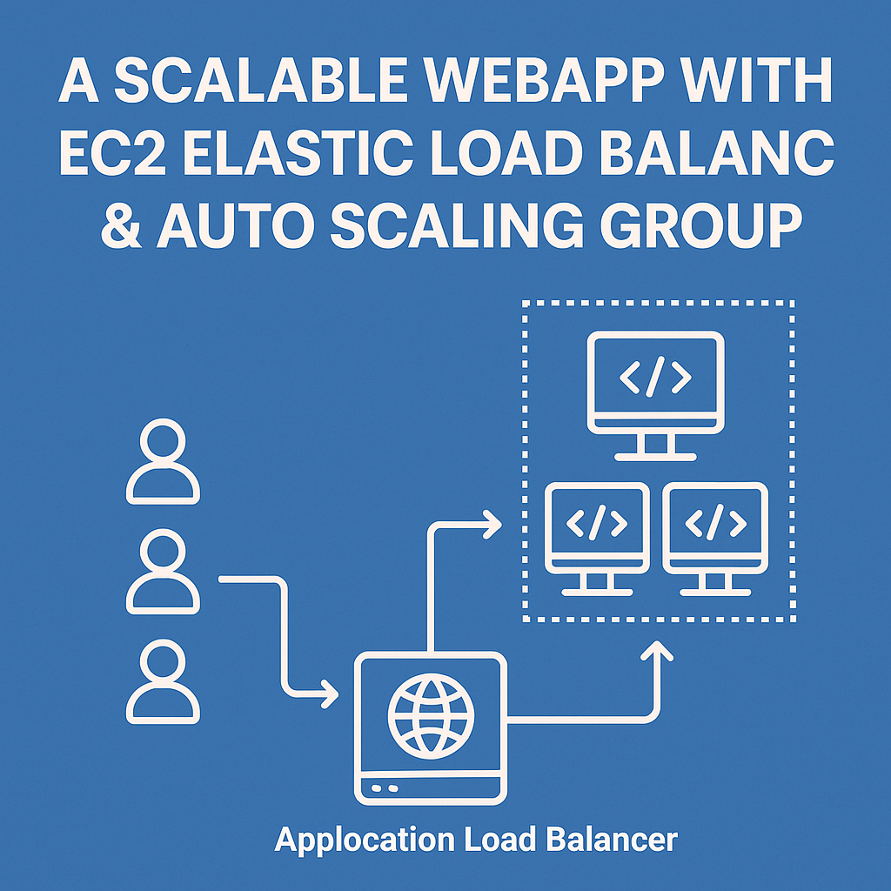
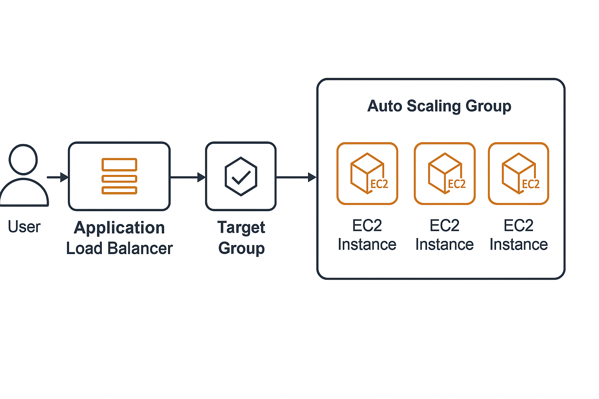

# 🚀 Scalable WebApp with EC2 Elastic Load Balancer & Auto Scaling Group



[](https://aws.amazon.com/)  
[](https://ubuntu.com/)  
[](https://httpd.apache.org/)

---

## 📑 Table of Contents
- [Project Description](#project-description)
- [Architecture Overview](#architecture-overview)
- [Installation Steps](#installation-steps)
- [Testing](#testing)
- [Auto Scaling Verification](#auto-scaling-verification)
- [Technologies Used](#technologies-used)
- [Contributors](#contributors)

---

## 📖 Project Description
This project demonstrates the setup of a **scalable** and **highly available** web application infrastructure using AWS services such as **Amazon EC2**, **Elastic Load Balancer (ALB)**, and **Auto Scaling Group (ASG)**.

The goal is to allow the WebApp to **automatically scale** during traffic spikes and **maintain high availability** with zero manual intervention.

---

## 👥 Collaborators

- **Eric Gomado**
- **Augustine Tetteh Ozor**

---

## 🏛️ Architecture Overview



---

- **Auto Scaling** is configured based on CPU Utilization.
- **ALB** distributes traffic across instances in **multiple Availability Zones**.
- **Apache2** Web Server serves a simple HTML page displaying the hostname.

---

## ⚙️ Installation Steps

### Step 1: Launch an EC2 Instance
- Go to **EC2** → **Instances** → **Launch Instance**.
- Configure:
  - **Name**: `webapp`
  - **Amazon AMI**: Ubuntu
  - **Instance Type**: `t2.micro`
  - **Key Pair**: Create/select an existing key pair.
  - **Security Group**:
    - Allow **port 22** (SSH) and **port 80** (HTTP).
- Add the following **User Data**:
    ```bash
    #!/bin/bash
    sudo apt-get update
    sudo apt-get install -y apache2
    sudo systemctl start apache2
    sudo systemctl enable apache2
    echo "<h1>Hello from $(hostname -f)</h1>" > /var/www/html/index.html
    ```
- Launch the instance.

---

### Step 2: Create a Launch Template
- Go to **EC2** → **Launch Templates** → **Create Launch Template**.
- Settings:
  - **Launch Template Name**: `webapp-LT`
  - **Auto Scaling guidance**: Enabled.

---

### Step 3: Create a Target Group
- Go to **EC2** → **Target Groups** → **Create Target Group**.
- Settings:
  - **Target type**: Instance
  - **Target group name**: `webapp-TG`
  - Leave default settings.
- Register the running instance.

---

### Step 4: Create an Application Load Balancer (ALB)
- Go to **EC2** → **Load Balancers** → **Create Load Balancer** → **Application Load Balancer**.
- Settings:
  - **Name**: `webapp-ALB`
  - **Scheme**: Internet-facing
  - **VPC**: Same as your EC2 instances.
  - **Availability Zones**: Choose at least 2.
  - **Listener Protocol**: HTTP on port 80.
  - **Target Group**: Select `webapp-TG`.
  - **Security Group**: Allow HTTP (port 80).

---

### Step 5: Create an Auto Scaling Group
- Go to **EC2** → **Auto Scaling Groups** → **Create Auto Scaling Group**.
- Settings:
  - **Launch Template**: Select `webapp-LT`.
  - **Group Size**:
    - Desired Capacity: 2
    - Minimum Instances: 1
    - Maximum Instances: 4
  - **Network**: Choose VPC and select at least 2 subnets.
  - **Load Balancer**: Attach `webapp-ALB`.
- **Scaling Policies** (Optional but recommended):
  - **Scale Out**: Add instance when CPU > 60%
  - **Scale In**: Remove instance when CPU < 40%

---

## 🧪 Testing

- Open your browser and visit: http://your-alb-dns-name


- Expected output: Hello from (hostname of instance)


- Refreshing multiple times will show responses from different instances.

---

## 🔄 Auto Scaling Verification

- Manually **stop or terminate** an EC2 instance from the Auto Scaling Group.
- The **Auto Scaling Group** will **automatically launch a new instance** to maintain the desired capacity!

---

## 🛠️ Technologies Used

- **Amazon EC2**
- **Elastic Load Balancer (ALB)**
- **Auto Scaling Group (ASG)**
- **Amazon VPC**
- **Apache2 Web Server (Ubuntu)**

---
